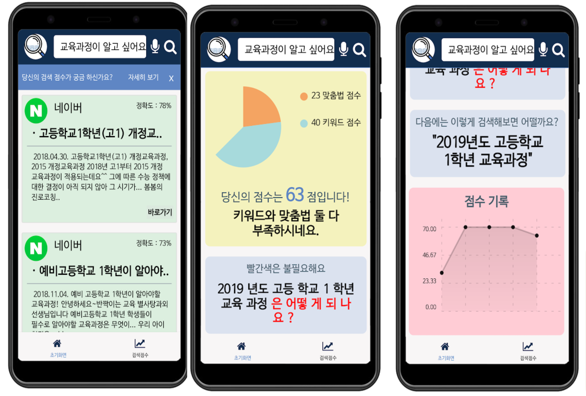

# 길잡이
## 프로젝트 설명

**길잡이**는 정보 취약 계층을 위한 검색 도움 어플리케이션입니다. 구어체로 검색하더라도 핵심 단어와 문장의 의미를 이해해 더 나은 검색어로 변경해 주는 것을 목표로 합니다. 추가적으로 검색에 대한 피드백을 제공해 더 나은 검색이 가능하게 합니다.


## 기술 스택

## 프로젝트 실행
서버
```
cd /server
node app.js
```
어플리케이션 빌드
```
cd /searchGuide
expo build:android
```